<div align="center">



</div>

```
                          _        
  _   _  ___ ___ _ __ | |_ __ _ 
 | | | |/ __/ _ \ '_ \| __/ _` |
 | |_| | (_|  __/ | | | || (_| |
  \__, |\___\___|_| |_|\__\__,_|
  |___/                          
```

<div align="center">

**Creative Developer · Builder of Things · Maker at Heart**

[](https://cv.ycenta.fr/)
[](https://github.com/ycenta)

</div>

---

### About Me

- I love building **apps, games, and creative tools**
- I work across the full stack — from **frontend** to **hardware**
- Game dev enthusiast (Unity, GDScript, even NDS homebrew!)
- Currently exploring **Rust** and **Tauri**
- Based in France

---

### Tech Stack

<div align="center">


</div>

---

### Most Used Languages

<div align="center">


</div>

---

### Highlighted Projects

| Project | Description |
|---------|-------------|
| [Cards of Artists](https://github.com/ycenta/cardsofartistv3) | A TCG-style creative project |
| [Twitch Chat Unity](https://github.com/ycenta/twitch-chat-unity) | Twitch chat integration for Unity |
| [Sticky App](https://github.com/ycenta/sticky-app) | A sticky notes desktop app |
| [FocusFlow](https://github.com/ycenta/focusflow) | Productivity & focus tool |
| [Among Us NDS](https://github.com/ycenta/amongus-nds-game) | Among Us homebrew on Nintendo DS |

---

### Playground

<div align="center">

[](./assets/pixel-cat.svg)

*Click the cat to open the interactive version — hover each pixel!*

</div>

---

<div align="center">


*"Ship it, break it, fix it, ship it again."*

</div>
